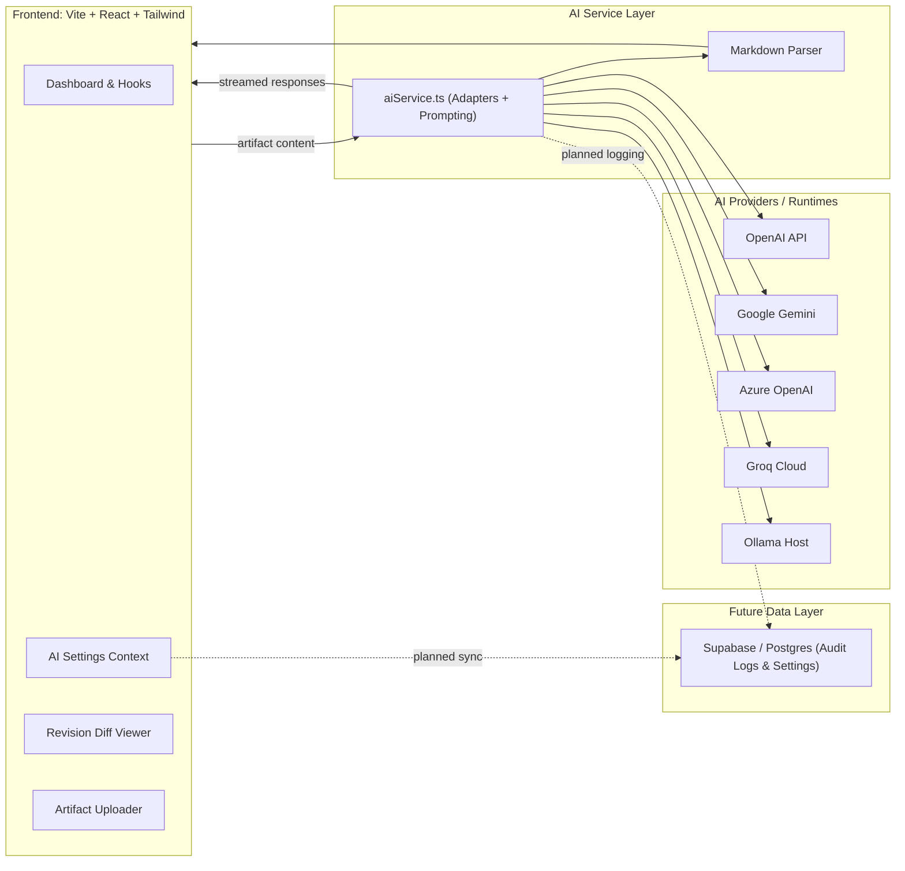
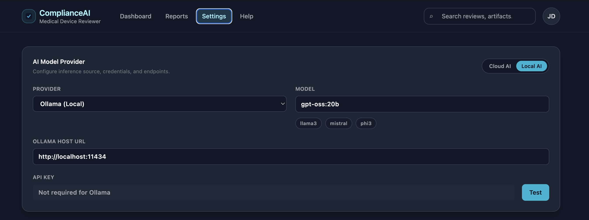
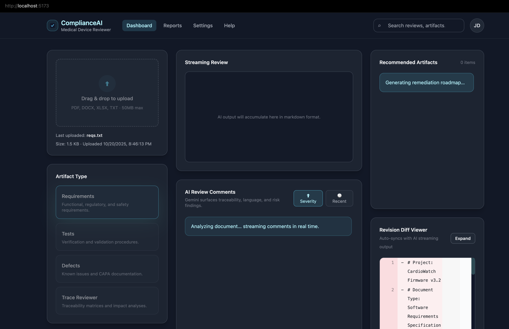
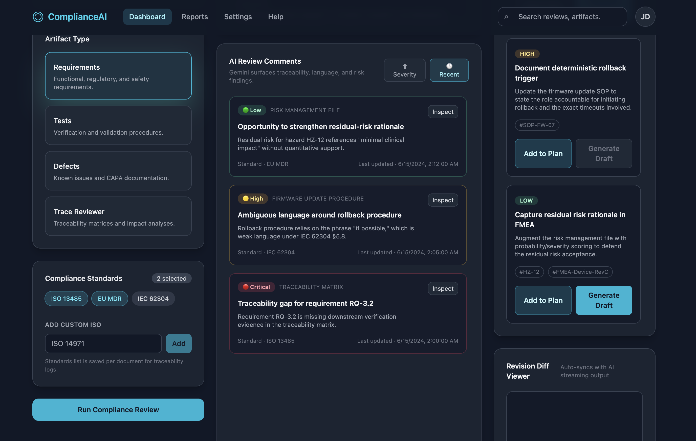
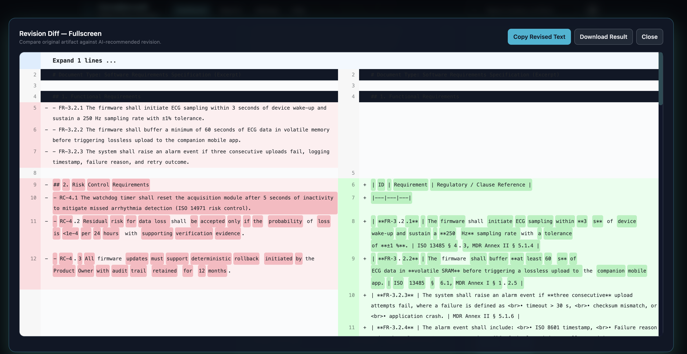

# ComplianceAI – Medical Device Compliance Reviewer

> **Status:** Active development. Core flows are functional, but expect sharp edges while integrations and testing coverage continue to grow.

ComplianceAI is a dark-themed SaaS dashboard that streamlines medical-device documentation reviews against ISO 13485, IEC 62304, EU MDR, and related standards. The app ingests requirements, tests, defect logs, or traceability artifacts, streams AI findings in real time, and recommends remediation actions using configurable cloud or local (Ollama) models – with a visual experience inspired by modern compliance control rooms.

---

## Table of Contents
1. [Key Features](#key-features)
2. [Architecture Overview](#architecture-overview)
3. [Getting Started](#getting-started)
4. [Environment Configuration](#environment-configuration)
5. [Running the App](#running-the-app)
6. [Product Tour](#product-tour)
7. [AI Providers & Connectivity](#ai-providers--connectivity)
8. [Project Structure](#project-structure)
9. [Testing & Quality](#testing--quality)
10. [Troubleshooting](#troubleshooting)
11. [Contributing](#contributing)
12. [License](#license)

---

## Key Features
- **Streaming AI reviews** for requirements, verification plans, defect logs, or traceability matrices.
- **Multi-provider inference**: OpenAI, Google Gemini, Azure OpenAI, Groq Cloud, or local Ollama models.
- **Structured insights**: Severity-tagged comment feed, recommended remediation artifacts, and revision diff viewer with copy/download capabilities.
- **Dark-mode dashboard** mirroring the ComplianceAI visual aesthetic (3-column layout, responsive Tailwind CSS).
- **Persistent AI settings** stored in-browser today, with hooks prepared for future Supabase/Postgres sync.
- **Realistic sample documents** under `test/` for immediate end-to-end validation.

---

## Architecture Overview



| Layer        | Tech / Notes                                                                                  |
|--------------|------------------------------------------------------------------------------------------------|
| Frontend     | React 18, TypeScript, Vite, Tailwind CSS (dark-mode utility classes, Inter + Fira Code fonts) |
| State        | Local component state + dedicated `AISettingsContext` with `localStorage` persistence         |
| Services     | `src/services/aiService.ts` handles streaming + non-streaming AI integrations                 |
| Visualization| ReactMarkdown, React Diff Viewer (split diff view for revisions)                              |
| Styling      | Tailwind CSS + custom shadows/scrollbars                                                      |
| Planning     | Types defined in `src/types.ts` for comments, recommendations, metadata, and AI settings      |

---

## Getting Started

### Prerequisites
- Node.js 18+ (recommended: 18.17 or newer)
- npm 9+ (or yarn/pnpm if preferred)
- Git (for source control)
- Optional for local inference: [Ollama](https://github.com/ollama/ollama) running on the same machine or accessible network host

### Installation
```bash
git clone https://github.com/<your-org>/ComplianceReviewer.git
cd ComplianceReviewer
npm install
```

### First Run Checklist
1. `npm run dev` – launch Vite dev server (default port 5173).
2. Open the dashboard, navigate to **Settings → AI Model**, and configure your provider.
3. Upload sample documents under `test/` or drag your own artifacts into the dashboard.
4. Expect occasional hiccups (missing recommendations, empty diff states). The roadmap below outlines how we’ll harden these flows.

---

## Environment Configuration

| Variable                     | Description                                                                            | Default                             |
|-----------------------------|----------------------------------------------------------------------------------------|-------------------------------------|
| `VITE_GEMINI_API_KEY`       | Optional fallback for Gemini if the Settings page is not used                          | _(empty)_                           |
| `VITE_GEMINI_MODEL`         | Default Gemini model identifier                                                        | `gemini-1.5-pro-latest`             |

The Settings UI overrides these via persisted browser storage (API keys, models, base URLs). When you deploy to a shared environment, consider elevating this state to Supabase/Postgres as planned.

---

## Running the App

```bash
npm run dev      # Start dev server with hot module reload
npm run build    # Generate production build in dist/
npm run preview  # Preview the production build locally
npm run lint     # Lint TypeScript/TSX sources (ESLint required if configured)
```

### Local Review Workflow
1. Open the app at the URL printed by `npm run dev`.
2. Configure AI settings (provider, model, API key or base URL). Hit **Test** to verify connectivity.
3. Upload or paste document text via the left column.
4. Select artifact type + standards, then click **Run Compliance Review**.
5. Watch streaming markdown, inspect severity-tagged comments, review recommended artifacts, and expand the revision diff as needed.

## Product Tour

Get a feel for the dashboard flow before running your own review.

1. **Configure provider settings** – pick an AI vendor and test connectivity.
   

2. **Stream a compliance review** – watch findings arrive in real time while artifacts are analyzed.
   

3. **Review structured results** – scan severity-tagged comments, recommended remediation steps, and related metadata.
   

4. **Compare revisions** – expand the split diff to inspect suggested text updates.
   

---

## AI Providers & Connectivity

| Provider | Notes                                                                                                               |
|----------|---------------------------------------------------------------------------------------------------------------------|
| OpenAI   | Requires `sk-...` key. Uses chat completions endpoint.                                                              |
| Gemini   | Uses `@google/generative-ai` streaming API. Requires `VITE_GEMINI_API_KEY` or key via Settings.                     |
| Azure    | Needs deployment endpoint URL + API key (set in Settings).                                                          |
| Groq     | Compatible with OpenAI API. Provide base URL (e.g., `https://api.groq.com/openai/v1`) and key.                       |
| Ollama   | Works via `/api/generate`. Ensure CORS allows the app origin (e.g., `OLLAMA_ORIGINS=http://localhost:5173 ollama serve`). |

If a provider call fails, the error surfaces in the banner and no mock data is loaded, simplifying debugging.

---

## Project Structure
```
src/
  components/        # Reusable UI: uploader, selectors, review list, diff viewer, etc.
  context/           # AI settings context with localStorage persistence
  pages/             # High-level views: App, Dashboard, Settings, Reports, Help
  services/          # AI service (multi-provider) integration layer
  styles/            # Global Tailwind entrypoint + custom scrollbar styling
  utils/             # Markdown parser for extracting comments/recommendations
  types.ts           # Shared TypeScript interfaces / enums
test/
  reqs.txt           # Sample software requirements excerpt
  d.txt              # Sample CAPA / investigation document
public/favicon.svg   # Shared logo (checkmark badge)
index.html           # Vite entry, sets dark mode + document title
```

---

## Testing & Quality
- **Linting**: `npm run lint` (configure ESLint rules per team preference).
- **Unit tests**: Not yet implemented—recommend starting with vitest or jest + React Testing Library targeting:
  - `aiService.ts` (mocked providers + parser outputs)
  - `AISettingsContext` persistence and provider switching
  - Component rendering (upload flow, diff viewer expansion)
- **Manual regression**: Use `test/` artifacts to validate streaming, structured insights, recommendations, and diff interactions with each provider you support.

---

## Roadmap

- **Database & Audit Trail**: Persist reviews, settings, and AI traceability metadata in Supabase/Postgres.
- **Integration Connectors**: Import artifacts from Jira, Confluence, GitLab/GitHub, and risk management tools.
- **Expanded Testing**: Automated coverage (unit + integration) across AI providers, parsers, and dashboard interactions.
- **Team Workspaces**: Multi-user roles, shared review history, and admin dashboards.
- **Compliance Playbooks**: Pre-built prompts + remediation templates tuned for ISO 13485, IEC 62304, and EU MDR audits.

---

## Troubleshooting

| Issue | Resolution |
|-------|------------|
| **Ollama CORS error** | Launch Ollama with the dev server origin: `OLLAMA_ORIGINS=http://localhost:11434/ ollama serve`. Alternatively proxy requests through a backend. |
| **No recommendations shown** | Ensure the AI model outputs actionable bullet points. The parser skips empty/whitespace entries; low severity is still displayed when non-empty. |
| **Diff viewer stuck on “Preparing…”** | Usually indicates the AI response never produced revision text. Check the provider response in dev tools and confirm the separator `|||---REVISED_TEXT_SEPARATOR---|||` exists. |
| **Settings lost after reload** | Browser storage may be blocked. Verify `localStorage` permissions or implement the planned Supabase/Postgres sync. |
| **Provider error banner** | Inspect console for the full response. Invalid API keys, missing deployment URLs, or network restrictions are the usual culprits. |

---

## Contributing
1. Fork and clone the repository.
2. Create a feature branch: `git checkout -b feat/my-enhancement`.
3. Commit with clear messages following Conventional Commits (`feat:`, `fix:`, etc.).
4. Ensure lint/build scripts succeed.
5. Submit a pull request referencing related issues or regulatory tickets.

---

## License

This project is licensed under the [MIT License](LICENSE). You’re free to use, modify, and distribute it with attribution.

---

**Questions or enhancements?** Open an issue or start a discussion in your GitHub repo once it’s published. We’re excited to see how you tailor ComplianceAI for your regulatory workflows!
