# ComplianceAI – Medical Device Compliance Reviewer

> **Status:** Active development. Core flows are functional, but expect sharp edges while integrations and testing coverage continue to grow.

ComplianceAI is a dark-themed SaaS dashboard that streamlines medical-device documentation reviews against ISO 13485, IEC 62304, EU MDR, and related standards. The app ingests requirements, tests, defect logs, or traceability artifacts, streams AI findings in real time, and recommends remediation actions using configurable cloud or local (Ollama) models – with a visual experience inspired by modern compliance control rooms.

---

## Table of Contents
1. [Key Features](#key-features)
2. [Architecture Overview](#architecture-overview)
3. [Getting Started](#getting-started)
4. [Environment Configuration](#environment-configuration)
5. [Running the App](#running-the-app)
6. [Product Tour](#product-tour)
7. [AI Providers & Connectivity](#ai-providers--connectivity)
8. [Project Structure](#project-structure)
9. [Testing & Quality](#testing--quality)
10. [Troubleshooting](#troubleshooting)
11. [Contributing](#contributing)
12. [License](#license)

---

## Key Features
- **Streaming AI reviews** for requirements, verification plans, defect logs, or traceability matrices.
- **Multi-provider inference**: OpenAI, Google Gemini, Azure OpenAI, Groq Cloud, or local Ollama models.
- **Intelligent text preprocessing**: Automatic cleaning of document artifacts, empty lines, and formatting noise before AI analysis.
- **Advanced content filtering**: AI output validation removes UI artifacts, placeholders, and nonsense content for clean compliance insights.
- **Structured insights**: Severity-tagged comment feed, recommended remediation artifacts, and revision diff viewer with copy/download capabilities.
- **Optimized performance**: Code splitting and CDN loading eliminate large bundle sizes while maintaining fast loading.
- **Dark-mode dashboard** mirroring the ComplianceAI visual aesthetic (3-column layout, responsive Tailwind CSS).
- **Persistent AI settings** stored in-browser today, with hooks prepared for future Supabase/Postgres sync.
- **Realistic sample documents** under `test/` for immediate end-to-end validation.

---

## Architecture Overview

> **Need the full system map and backlog?** See [`docs/ARCHITECTURE.md`](docs/ARCHITECTURE.md) for an up-to-date deep dive, primary data flows (Mermaid diagrams), and the prioritized delivery backlog.

### Data Flow (Current vs Planned)

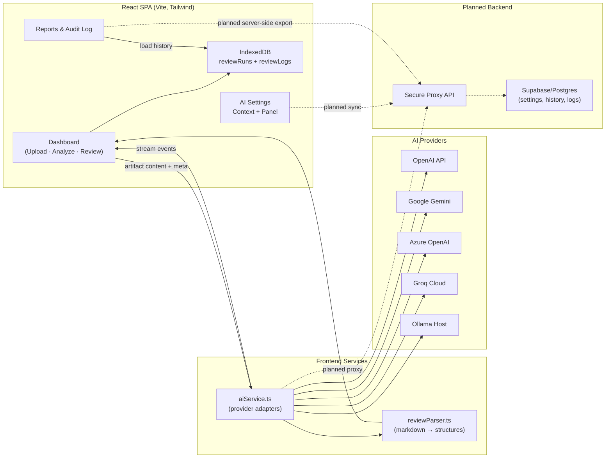
```mermaid
flowchart LR
  subgraph Client["React SPA (Vite, Tailwind)"]
    Dashboard["Dashboard\n(Upload · Analyze · Review)"]
    SettingsPanel["AI Settings\nContext + Panel"]
    ReportsUI["Reports & Audit Log"]
    IndexedDB["IndexedDB\nreviewRuns + reviewLogs"]
  end

  subgraph Services["Frontend Services"]
    AISvc["aiService.ts\n(provider adapters)"]
    Parser["reviewParser.ts\n(markdown → structures)"]
  end

  subgraph External["AI Providers"]
    OpenAI["OpenAI API"]
    Gemini["Google Gemini"]
    Azure["Azure OpenAI"]
    Groq["Groq Cloud"]
    Ollama["Ollama Host"]
  end

  subgraph Future["Planned Backend"]
    API["Secure Proxy API"]
    Supabase["Supabase/Postgres\n(settings, history, logs)"]
  end

  Dashboard -->|artifact content + meta| AISvc
  AISvc -->|stream events| Dashboard
  AISvc --> Parser --> Dashboard
  Dashboard --> IndexedDB
  ReportsUI -->|load history| IndexedDB

  AISvc --> OpenAI
  AISvc --> Gemini
  AISvc --> Azure
  AISvc --> Groq
  AISvc --> Ollama

  SettingsPanel -. planned sync .-> API -.-> Supabase
  AISvc -. planned proxy .-> API
  ReportsUI -. planned server-side export .-> API
```

### Review Run State Machine

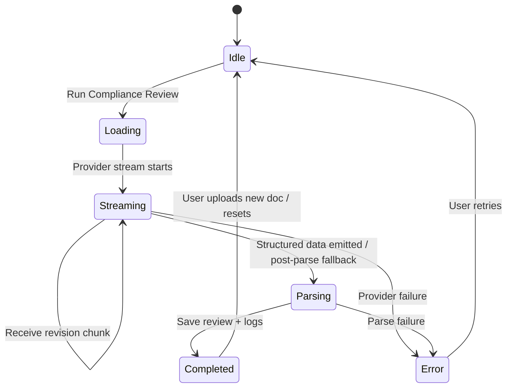
```mermaid
stateDiagram-v2
  [*] --> Idle
  Idle --> Loading: Run Compliance Review
  Loading --> Streaming: Provider stream starts
  Streaming --> Streaming: Receive review chunk
  Streaming --> Streaming: Receive revision chunk
  Streaming --> Parsing: Structured data emitted / post-parse fallback
  Parsing --> Completed: Save review + logs
  Streaming --> Error: Provider failure
  Parsing --> Error: Parse failure
  Completed --> Idle: User uploads new doc / resets
  Error --> Idle: User retries
```

### Component & Storage Map

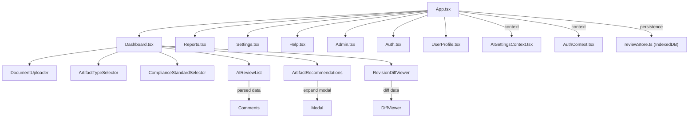
```mermaid
graph TD
  App["App.tsx"] --> DashboardPage["Dashboard.tsx"]
  App --> ReportsPage["Reports.tsx"]
  App --> SettingsPage["Settings.tsx"]
  App --> HelpPage["Help.tsx"]
  App --> AdminPage["Admin.tsx"]
  App --> AuthPage["Auth.tsx"]
  App --> UserProfilePage["UserProfile.tsx"]

  DashboardPage --> DocumentUploader["DocumentUploader"]
  DashboardPage --> ArtifactTypeSelector["ArtifactTypeSelector"]
  DashboardPage --> ComplianceStandardSelector["ComplianceStandardSelector"]
  DashboardPage --> AIReviewList["AIReviewList"]
  DashboardPage --> ArtifactRecommendations["ArtifactRecommendations"]
  DashboardPage --> RevisionDiffViewer["RevisionDiffViewer"]

  App -->|context| AISettingsContext["AISettingsContext.tsx"]
  App -->|context| AuthContext["AuthContext.tsx"]
  App -->|persistence| ReviewStore["reviewStore.ts (IndexedDB)"]

  ArtifactRecommendations -->|expand modal| Modal
  RevisionDiffViewer -->|diff data| DiffViewer
  AIReviewList -->|parsed data| Comments
```

### Delivery Health

| Area | Implemented | Planned | Needs Fix |
|------|-------------|---------|-----------|
| Document ingestion | ✅ Text/PDF/DOCX/XLSX parsing with 10 MB cap | Worker offload, parse warnings | — |
| AI provider routing | ✅ Multi-provider adapters, streaming | Secure proxy, expanded catalogue | ❗ Blocking cloud providers until proxy |
| Structured outputs | ✅ Markdown parser (lists + tables) → comments/recs | NLP post-processing for duplicates | — |
| Persistence | ✅ IndexedDB history + audit logs | Supabase/Postgres sync, export APIs | ❗ Data siloed per browser |
| Settings | ✅ Local storage (no API key persistence) | RBAC, server-side storage | ❗ Anyone can change provider config |
| Reporting | ✅ Local history + audit log viewer | Filters, export bundles, remote logging | — |
| Observability | ✅ Client-side audit log (chunks/revisions) | Centralized telemetry/alerts | ❗ No remote monitoring |

| Layer        | Tech / Notes                                                                                  |
|--------------|------------------------------------------------------------------------------------------------|
| Frontend     | React 18, TypeScript, Vite, Tailwind CSS (dark-mode utility classes, Inter + Fira Code fonts) |
| State        | Local component state + dedicated `AISettingsContext` with `localStorage` persistence         |
| Services     | `src/services/aiService.ts` handles streaming + non-streaming AI integrations                 |
| Visualization| ReactMarkdown, React Diff Viewer (split diff view for revisions)                              |
| Styling      | Tailwind CSS + custom shadows/scrollbars                                                      |
| Planning     | Types defined in `src/types.ts` and `src/types/external.d.ts` for comments, recommendations, metadata, and AI settings      |

### Text Processing Pipeline

ComplianceAI implements a sophisticated multi-stage text processing pipeline to ensure high-quality AI analysis:

#### Stage 1: Document Ingestion & Cleaning
- **Format Detection**: Automatic parsing of PDF, DOCX, XLSX, and plain text files
- **Text Extraction**: Format-specific extraction with `pdfjs-dist`, `mammoth`, and `xlsx` libraries
- **Artifact Removal**: `textCleaner.ts` removes page breaks, headers/footers, empty lines, and formatting noise
- **Content Normalization**: Spacing cleanup and character encoding standardization

#### Stage 2: AI Analysis
- **Enhanced Prompting**: Structured prompts with compliance-specific examples and clear formatting instructions
- **Multi-Provider Support**: Streaming responses from OpenAI, Gemini, Azure, Groq, or Ollama
- **Real-time Processing**: Incremental result streaming for immediate user feedback

#### Stage 3: Output Validation & Filtering
- **Content Quality Check**: `reviewParser.ts` validates AI responses for meaningful content
- **Nonsense Filtering**: Removes UI artifacts, placeholders, and generic AI hallucinations
- **Structured Parsing**: Converts markdown into severity-tagged comments and recommendations
- **Fallback Handling**: Graceful degradation when AI produces poor quality output

#### Stage 4: Performance Optimization
- **Code Splitting**: Large libraries (PDF.js, mammoth, xlsx) loaded on-demand
- **CDN Loading**: PDF.js worker served externally to reduce bundle size
- **Lazy Loading**: Document processing libraries loaded only when needed

---

## Getting Started

### Prerequisites
- Node.js 18+ (recommended: 18.17 or newer)
- npm 9+ (or yarn/pnpm if preferred)
- Git (for source control)
- Optional for local inference: [Ollama](https://github.com/ollama/ollama) running on the same machine or accessible network host

### Installation
```bash
git clone https://github.com/<your-org>/ComplianceReviewer.git
cd ComplianceReviewer
npm install
```

### First Run Checklist
1. `npm run dev` – launch Vite dev server (default port 5173).
2. Open the dashboard, navigate to **Settings → AI Model**, and configure your provider.
3. Upload sample documents under `test/` or drag your own artifacts into the dashboard.
4. Expect occasional hiccups (missing recommendations, empty diff states). The roadmap below outlines how we’ll harden these flows.

---

## Environment Configuration

| Variable                     | Description                                                                            | Default                             |
|-----------------------------|----------------------------------------------------------------------------------------|-------------------------------------|
| `VITE_GEMINI_API_KEY`       | Optional fallback for Gemini if the Settings page is not used                          | _(empty)_                           |
| `VITE_GEMINI_MODEL`         | Default Gemini model identifier                                                        | `gemini-1.5-pro-latest`             |
| `VITE_DISABLE_CLOUD_PROVIDERS` | Set to `true` to force local-only mode (cloud providers remain enabled by default)     | `false`                             |
| `VITE_AZURE_OPENAI_API_VERSION`| Override the default Azure OpenAI API version appended during chat completions calls | `2024-02-15-preview`                |

The Settings UI overrides these via persisted browser storage (API keys, models, base URLs). When you deploy to a shared environment, consider elevating this state to Supabase/Postgres as planned.

---

## Running the App

```bash
npm run dev      # Start dev server with hot module reload
npm run build    # Generate production build in dist/
npm run preview  # Preview the production build locally
npm run lint     # Lint TypeScript/TSX sources (ESLint required if configured)
```

### Local Review Workflow
1. Open the app at the URL printed by `npm run dev`.
2. Configure AI settings (provider, model, API key or base URL). Hit **Test** to verify connectivity.
3. Upload or paste document text via the left column.
4. Select artifact type + standards, then click **Run Compliance Review**.
5. Watch streaming markdown, inspect severity-tagged comments, review recommended artifacts, and expand the revision diff as needed.

## Product Tour

Get a feel for the workflow before you run your first review.

### 1. Account Access

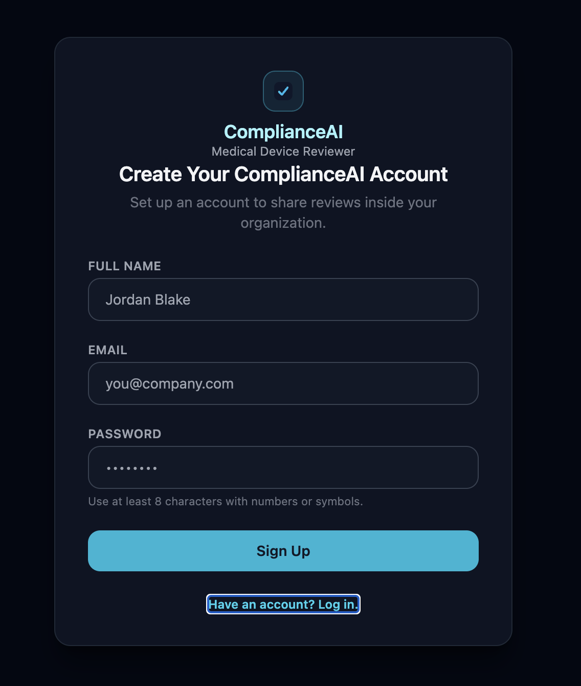
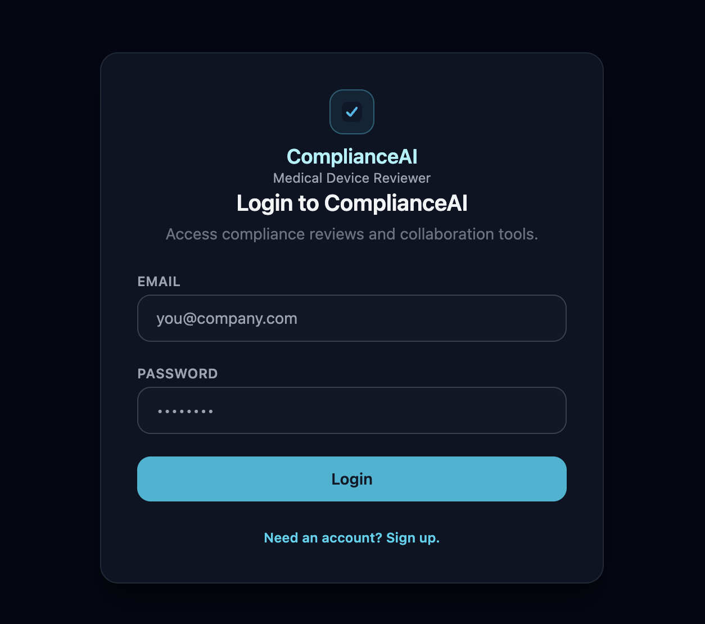

- Onboarding starts with a web-native signup/login experience that mirrors the production branding.

### 2. Configure AI Provider

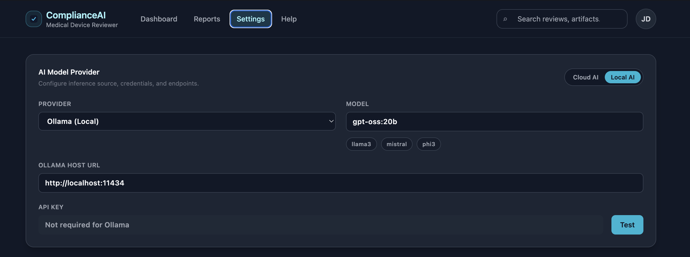

- Choose a cloud or on-prem model, set base URLs/API keys, and run a connectivity test before launching a review.

### 3. Upload & Analyze

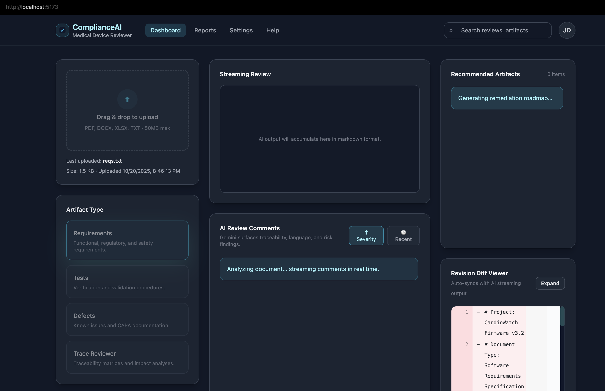

- Drag-and-drop DOCX, PDF, XLSX, or text artifacts. A live progress indicator confirms parsing status.

### 4. Stream Findings

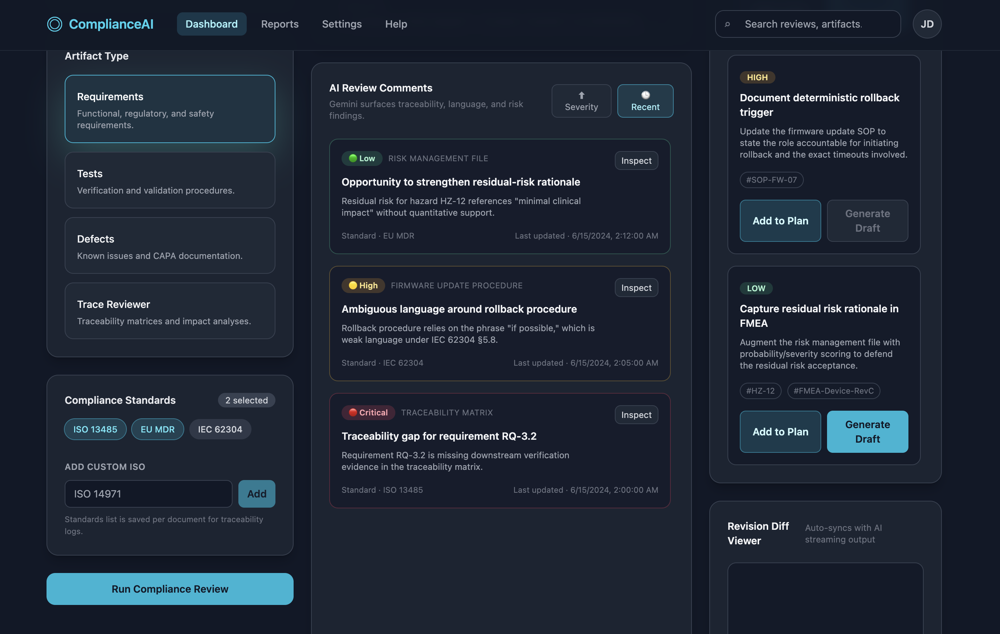

- View severity-tagged comments, recommendations, and metadata as they arrive from the AI provider.

### 5. Inspect Revisions

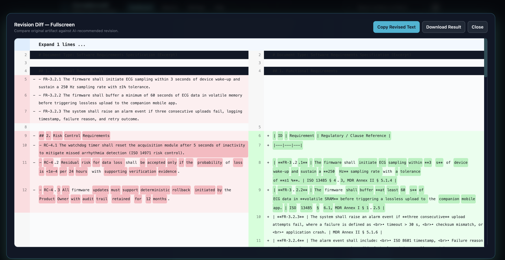

- Compare AI-suggested updates against the original artifact using the split diff viewer.

### 6. Review History & Logs

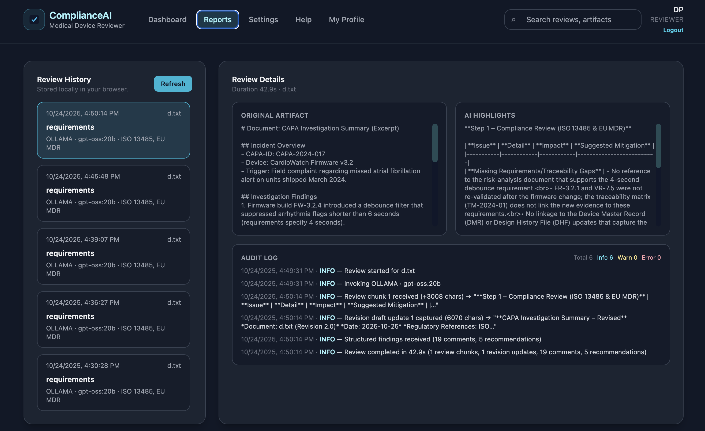

- Audit every review run, including durations, providers, and log entries stored locally today (Compliance Hub coming soon).

### 7. Manage Your Profile

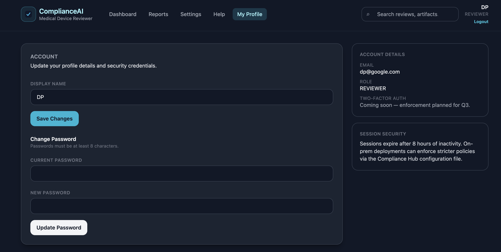

- Update display names and change passwords directly in-app until centralized identity/AD sync is enabled.

### 8. Execution Flow Overview


- Zoomed-out architecture view of how uploads, AI processing, and storage will connect once the on-prem Compliance Hub ships. Dive deeper in [`docs/ARCHITECTURE.md`](docs/ARCHITECTURE.md).

---

## AI Providers & Connectivity

| Provider | Notes                                                                                                               |
|----------|---------------------------------------------------------------------------------------------------------------------|
| OpenAI   | Requires `sk-...` key. Uses chat completions endpoint.                                                              |
| Gemini   | Uses `@google/generative-ai` streaming API. Requires `VITE_GEMINI_API_KEY` or key via Settings.                     |
| Azure    | Needs deployment endpoint URL + API key (set in Settings).                                                          |
| Groq     | Compatible with OpenAI API. Provide base URL (e.g., `https://api.groq.com/openai/v1`) and key.                       |
| Ollama   | Works via `/api/generate`. Ensure CORS allows the app origin (e.g., `OLLAMA_ORIGINS=http://localhost:5173 ollama serve`). |

If a provider call fails, the error surfaces in the banner and no mock data is loaded, simplifying debugging.

---

## Project Structure
```
src/
  components/        # Reusable UI: uploader, selectors, review list, diff viewer, etc.
  context/           # React contexts: AI settings and authentication
  mocks/             # Mock data for development/testing
  pages/             # Page components: Dashboard, Settings, Reports, Auth, Admin, etc.
  services/          # Business logic: AI service and review storage
  styles/            # Global Tailwind entrypoint + custom scrollbar styling
  types/             # TypeScript type definitions
    external.d.ts    # External library type declarations
  types.ts           # Shared TypeScript interfaces / enums
  utils/             # Utilities: text cleaning and markdown parsing
    textCleaner.ts   # Document preprocessing and artifact removal
    reviewParser.ts  # AI output parsing and content filtering
  main.tsx           # React app entry point
test/
  reqs.txt           # Sample software requirements excerpt
  d.txt              # Sample CAPA / investigation document
public/favicon.svg   # Shared logo (checkmark badge)
index.html           # Vite entry, sets dark mode + document title
```

---

## Testing & Quality
- **Linting**: `npm run lint` (configure ESLint rules per team preference).
- **Unit tests**: Not yet implemented—recommend starting with vitest or jest + React Testing Library targeting:
  - `aiService.ts` (mocked providers + parser outputs)
  - `AISettingsContext` persistence and provider switching
  - Component rendering (upload flow, diff viewer expansion)
- **Manual regression**: Use `test/` artifacts to validate streaming, structured insights, recommendations, and diff interactions with each provider you support.

---

## Roadmap

- **Database & Audit Trail**: Persist reviews, settings, and AI traceability metadata in Supabase/Postgres.
- **Integration Connectors**: Import artifacts from Jira, Confluence, GitLab/GitHub, and risk management tools.
- **Expanded Testing**: Automated coverage (unit + integration) across AI providers, parsers, and dashboard interactions.
- **Team Workspaces**: Multi-user roles, shared review history, and admin dashboards.
- **Compliance Playbooks**: Pre-built prompts + remediation templates tuned for ISO 13485, IEC 62304, and EU MDR audits.

---

## Troubleshooting

| Issue | Resolution |
|-------|------------|
| **Ollama CORS error** | Launch Ollama with the dev server origin: `OLLAMA_ORIGINS=http://localhost:11434/ ollama serve`. Alternatively proxy requests through a backend. |
| **No recommendations shown** | Ensure the AI model outputs actionable bullet points. The parser skips empty/whitespace entries; low severity is still displayed when non-empty. |
| **Diff viewer stuck on “Preparing…”** | Usually indicates the AI response never produced revision text. Check the provider response in dev tools and confirm the separator `|||---REVISED_TEXT_SEPARATOR---|||` exists. |
| **Settings lost after reload** | Browser storage may be blocked. Verify `localStorage` permissions or implement the planned Supabase/Postgres sync. |
| **Provider error banner** | Inspect console for the full response. Invalid API keys, missing deployment URLs, or network restrictions are the usual culprits. |

---

## Contributing
1. Fork and clone the repository.
2. Create a feature branch: `git checkout -b feat/my-enhancement`.
3. Commit with clear messages following Conventional Commits (`feat:`, `fix:`, etc.).
4. Ensure lint/build scripts succeed.
5. Submit a pull request referencing related issues or regulatory tickets.

---

## License

This project is licensed under the [MIT License](LICENSE). You’re free to use, modify, and distribute it with attribution.

---

**Questions or enhancements?** Open an issue or start a discussion in your GitHub repo once it’s published. We’re excited to see how you tailor ComplianceAI for your regulatory workflows!
