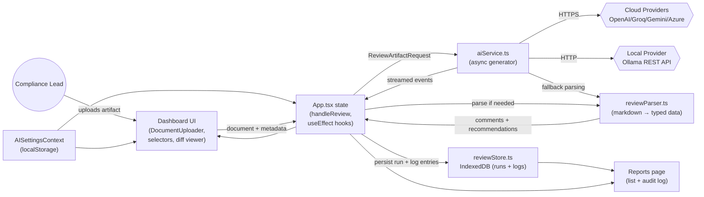
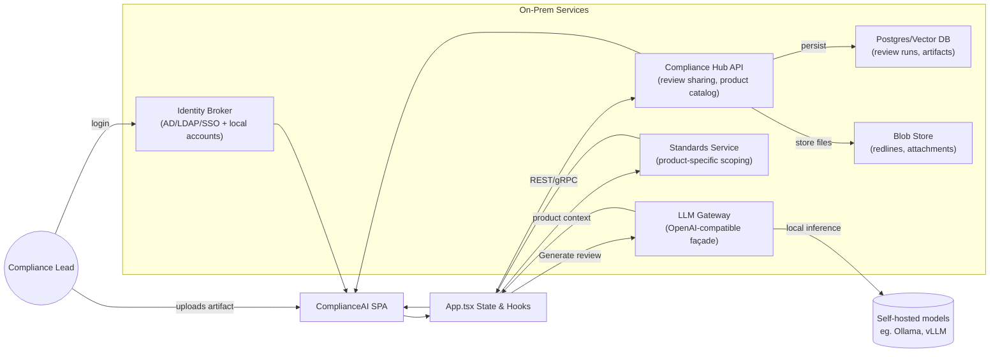
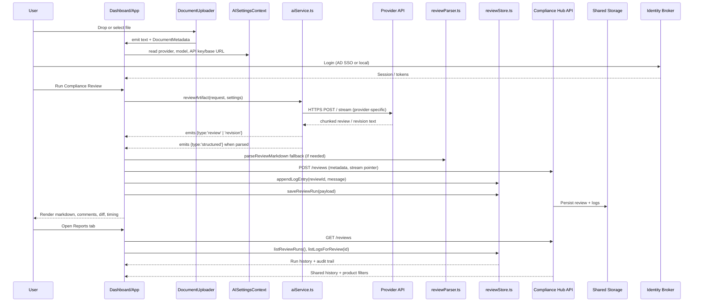

# ComplianceAI Architecture & Backlog

## Overview
- Single-page application built with React 18, TypeScript, Vite, and Tailwind CSS.
- `App.tsx` orchestrates upload → review → persistence → reporting flows.
- AI provider configuration lives in `AISettingsContext`, persisted to `localStorage` (sans API keys).
- Review artifacts and audit logs are stored client-side with IndexedDB via `reviewStore.ts`.
- AI analysis is delegated to `aiService.ts`, which streams chunks from cloud (OpenAI-compatible, Gemini) or local (Ollama) providers and normalizes outputs.
- Target operating model is fully on-premises: inference, persistence, and sharing services run inside the customer network so regulated data never leaves their environment.

## System Context & Modules
- **UI shell**: `Layout.tsx` renders navigation, global search placeholder, and slot for active tab.
- **Dashboard**: Uploads documents (`DocumentUploader`), selects artifact type/standards, displays streaming markdown, structured findings (`AIReviewList`), and diff view (`RevisionDiffViewer`).
- **Settings**: `SettingsAIModel` + `AISettingsContext` collect provider, model, API key/base URL, and handle persistence.
- **Reports**: Fetches runs/logs from IndexedDB, surfaces audit trail, highlights, and fastest refresh.
- **Services**:
  - `aiService.ts`: Async generator that handles provider-specific HTTP calls and emits `review`, `revision`, `structured` events.
  - `reviewStore.ts`: IndexedDB layer for `reviewRuns` and `reviewLogs`.
  - `reviewParser.ts`: Converts markdown/free-form responses into typed comments and recommendations.

## Primary Data Flow (Current Frontend-Only Build)

## Target On-Prem Collaboration Flow

## Review Execution Sequence

## State & Persistence
- `App.tsx` holds transient state for the current review (document text, metadata, markdown stream, revision draft, structured findings, timers).
- `AISettingsContext` persists provider configuration to `localStorage`, stripping API keys before storage; keys stay in memory only.
- `reviewStore.ts` uses `idb` to maintain two object stores:
  - `reviewRuns`: keyed by run ID, indexed by timestamp for fast descending sort.
  - `reviewLogs`: keyed by log ID, indexed by review ID + timestamp.
- Reports tab keeps its own `selectedId` state and memoizes log aggregates for quick rendering.
- Target on-prem deployment will replace or complement IndexedDB with a shared “Compliance Hub” service backed by Postgres/Vector storage so teams can access reviews across products and devices while remaining air-gapped.
- Compliance Hub enforces retention schedules (configurable per product), encrypts records at rest with customer-managed keys, and serves data over mutual TLS; SPA communicates via HTTPS/TLS even in internal networks.

## External Integrations & Configuration
- Supported providers today: OpenAI, Google Gemini (streaming), Azure OpenAI, Groq (OpenAI-compatible), and local Ollama.
- On-prem roadmap favors self-hosted inference (Ollama, vLLM, NVIDIA NIM) exposed through an OpenAI-compatible gateway; external cloud calls become opt-in exceptions.
- Environment flags (`VITE_DISABLE_CLOUD_PROVIDERS`, `VITE_AZURE_OPENAI_API_VERSION`) govern provider availability and Azure versioning.
- Document ingestion relies on `pdfjs-dist`, `mammoth`, and `xlsx` for PDF/DOCX/XLSX parsing; heavy work currently runs on the main thread.
- UI assets (fonts, charts) are delivered via static files in `public/` and Tailwind CSS directives.
- Model updates are delivered via an internal artifact server; administrators can import new model weights or prompts into the LLM gateway without external connectivity.

## Delivery Backlog (To‑Do List)
| Priority | Theme | Item | Notes |
|----------|-------|------|-------|
| High | Collaboration | Ship Compliance Hub API (on-prem) for shared review workspace | REST/gRPC service with RBAC, review manifests, audit trails; backs the SPA instead of per-browser IndexedDB. |
| High | Standards Intelligence | Model product catalog → standards sections mapping | Allow team to define per-product standard subsets, conditional prompts, and saved templates. |
| High | Security & Inference | Package self-hosted LLM gateway with policy controls | Provide Docker/Kubernetes deployment for local models, API auth, auditing, and optional cloud egress disable switch. |
| High | Identity & Access | Integrate AD/LDAP SSO plus local signup/login | Identity broker supporting SSO, service accounts, MFA, role-based permissions, password policies. |
| High | Quality | Add automated tests (unit for utilities/components, integration for review flow) | Currently no automated coverage; adopt Vitest + React Testing Library, consider Playwright smoke run. |
| High | UX Safeguards | Add cancellation/reset controls while streaming reviews | Allow aborting `reviewArtifact` via `AbortController` to prevent orphaned requests. |
| Medium | AI Streaming | Implement incremental streaming for OpenAI-compatible providers | Presently waits for full completion; switch to server-sent events where available. |
| Medium | Document Processing | Move PDF/DOCX/XLSX parsing into a Web Worker or workerized library | Prevent long blocks on large artifacts and improve progress feedback. |
| Medium | Reporting | Implement collaborative search/filter/export | Cross-product filters, severity facets, encrypted export bundles served from Compliance Hub. |
| Medium | Observability | Instrument telemetry + error reporting pipeline | On-prem friendly: ship to customer-controlled stack (Elastic/OpenTelemetry) with opt-in remote support. |
| Low | Integrations | Wire `IntegrationCard` actions to actual third-party connectors | Currently stubbed; design on-prem connector agents. |

## Open Questions
- What default retention schedules satisfy diverse customer policies (e.g., 7-year vs. 15-year medical record keeping)?
- Should the LLM gateway support hot-reload of imported models or require maintenance windows?
- How will local signup accounts be approved/audited alongside directory-synced users?
